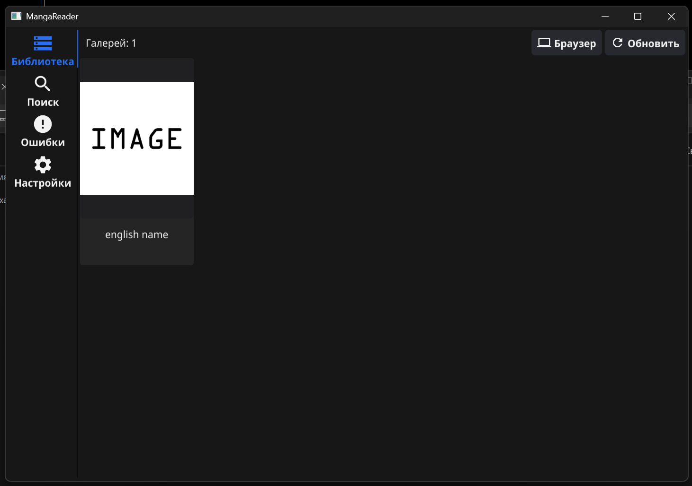
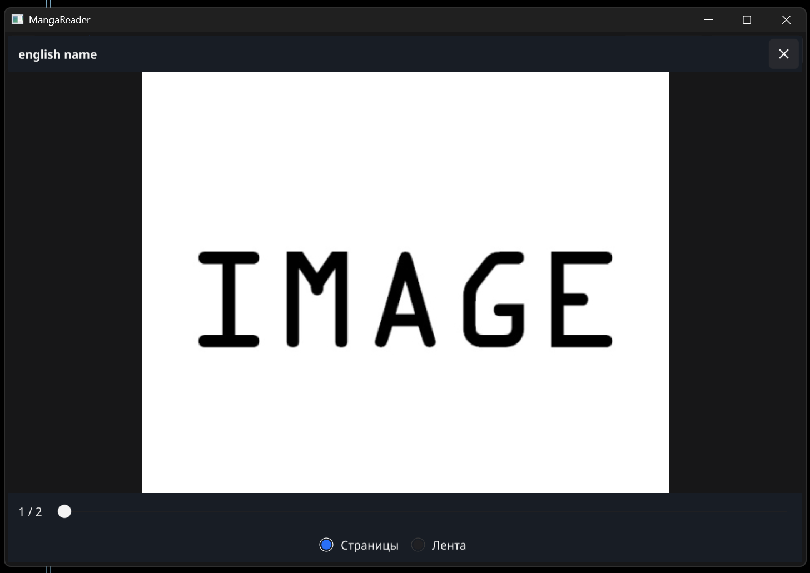
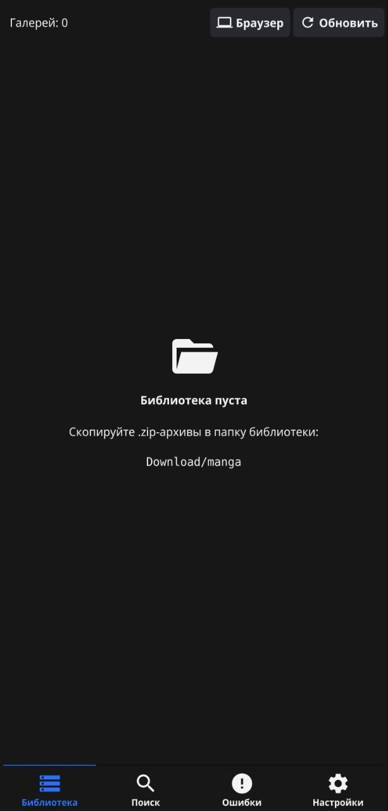

[English](README.md) | **Русский**

# MangaReader

[](https://github.com/DragonZero000/Manga-Reader/actions/workflows/ci.yml)
[](https://github.com/DragonZero000/Manga-Reader/releases/latest)
[](LICENSE)

Офлайн-читалка манги из zip-архивов для **Windows** и **Android** со встроенным браузером на движке Firefox: скачанные в нём архивы сразу попадают в библиотеку. Написана на Go и [Fyne](https://fyne.io).

> Интерфейс пока только на русском.

<p align="center">
  
  
  
</p>

## Возможности

- **Библиотека** — сетка обложек из папки с `.zip`-архивами; новые файлы появляются сами, без перезапуска.
- **Метаданные** — названия, теги по типам (автор, группа, персонаж, язык…), дата загрузки и другое из `meta.json` внутри архива.
- **Читалка** — постраничный режим (тап-зоны, свайп, клавиатура, увеличение ×2) и лента.
- **Поиск** — по словам и фразам, тегам, исключению тегов, числу страниц, датам, размеру файла; нажатие на тег ищет по нему.
- **Встроенный браузер** — Firefox ESR на Windows, GeckoView на Android; загрузки сохраняются прямо в библиотеку, приложение запоминает страницу, откуда скачан файл.
- **Ошибки** — всё, что не является архивом с картинками (HTML вместо архива, битый zip, PDF…), собрано на отдельной вкладке с причиной; файлы не удаляются.
- **Портативность на Windows** — всё хранится в одной папке, её можно носить на флешке.

## Скачать

Готовые сборки — на странице [Releases](https://github.com/DragonZero000/Manga-Reader/releases/latest):

| Файл | Для чего |
|---|---|
| `MangaReader-X.Y.Z-windows-x64.zip` | Windows 10/11, 64-бит (~155 МБ, встроенный браузер уже внутри) |
| `MangaReader-X.Y.Z-android-arm64.apk` | Android 11+ (~115 МБ) |
| `SHA256SUMS.txt` | Контрольные суммы: `sha256sum -c SHA256SUMS.txt` (Linux, Git Bash) или `Get-FileHash <файл>` (PowerShell) |

### Установка на Windows

1. Распакуйте zip в любую папку, где есть права на запись (не в `Program Files`), например `D:\MangaReader`.
2. Запустите `MangaReader\mangareader.exe`.
3. Кладите `.zip`-архивы в папку `manga` рядом с приложением или скачивайте их кнопкой **Браузер**.

Для обновления замените `mangareader.exe` и папку `browser\firefox` файлами из нового zip; `manga`, `settings.json` и `browser\profile` сохранятся.

### Установка на Android

1. Скачайте APK на телефон и откройте его; разрешите установку из этого источника, когда Android попросит.
2. При первом запуске выберите папку для библиотеки внутри `Download`, например `Download/manga`.

Новые релизы ставятся **поверх** старых: настройки и выбранная папка сохраняются. Если раньше вы ставили APK, собранный самостоятельно, его подпись другая — удалите его один раз перед установкой релиза (файлы манги не затрагиваются).

## Системные требования

| Платформа | Требования |
|---|---|
| Windows | Windows 10 или 11, x64; ~350 МБ на диске (вместе со встроенным Firefox) |
| Android | Android 11 или новее, arm64; ~250 МБ после установки |
| Linux, macOS | Пока не поддерживаются |

## Документация

- [Руководство пользователя](docs/ru/user-guide.md) — папка библиотеки, формат архива и `meta.json`, читалка, синтаксис поиска, браузер, ошибки, настройки.
- [Сборка и релизы](docs/ru/building.md) — требования, команды, Android, выпуск релиза, ключ подписи.
- [Архитектура](docs/ru/architecture.md) — пакеты, платформы, потоки, устройство браузера.

## Для разработчиков

```sh
make run            # запуск (нужны Go 1.26+ и gcc)
make test           # go vet + go test
make build-windows  # dist/mangareader.exe
make build-android  # dist/mangareader.apk (нужны Android Studio и NDK 27+)
```

Подробности — в [building.md](docs/ru/building.md). Как предложить изменение — в [CONTRIBUTING.ru.md](CONTRIBUTING.ru.md).

## Лицензия

Код проекта — [MIT](LICENSE). Сторонние компоненты (Firefox ESR, GeckoView, Fyne и др.) распространяются под своими лицензиями — см. [THIRD_PARTY_NOTICES.md](THIRD_PARTY_NOTICES.md). Firefox — товарный знак Mozilla Foundation; проект не связан с Mozilla.
