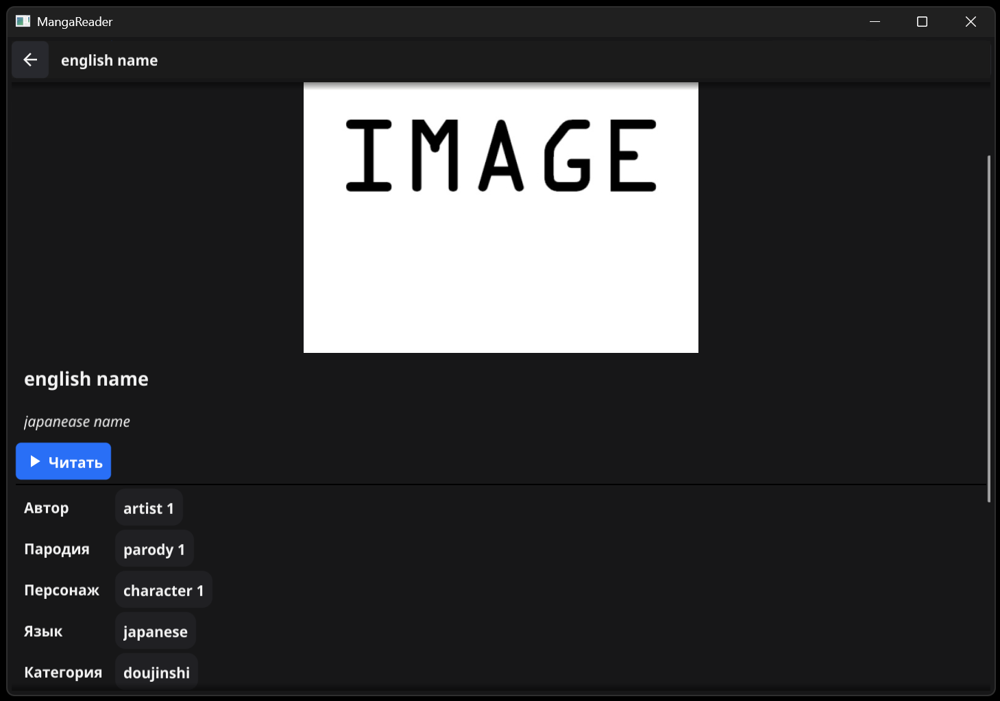
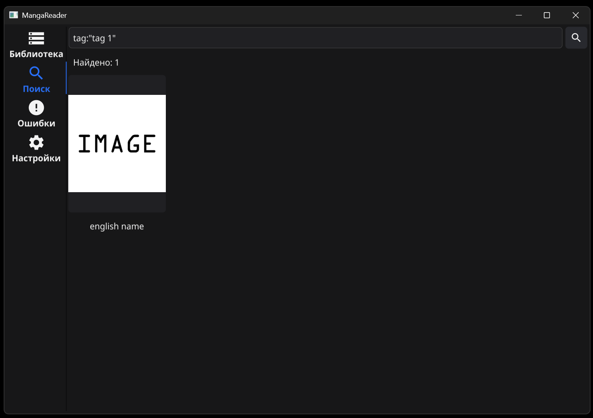

[English](../en/user-guide.md) | **Русский**

# Руководство пользователя

MangaReader показывает мангу из zip-архивов, которые лежат в папке библиотеки, и помогает пополнять её: встроенный браузер сохраняет загрузки прямо туда. Интернет нужен только браузеру — библиотека, читалка и поиск работают офлайн.

- [Папка библиотеки](#папка-библиотеки)
- [Формат архива](#формат-архива)
- [Библиотека](#библиотека)
- [Страница произведения](#страница-произведения)
- [Читалка](#читалка)
- [Поиск](#поиск)
- [Встроенный браузер](#встроенный-браузер)
- [Ошибки](#ошибки)
- [Настройки](#настройки)

## Папка библиотеки

### Windows — портативный режим

Всё хранится в папке приложения, больше нигде (ни в `%APPDATA%`, ни в профиле пользователя):

```text
MangaReader\
├── mangareader.exe
├── settings.json   ← настройки, появляется после первого изменения
├── manga\          ← сюда кладите .zip-архивы (создаётся при первом запуске)
└── browser\
    ├── firefox\    ← встроенный браузер
    └── profile\    ← профиль браузера: закладки, cookies, расширения
```

- Папку приложения можно переносить целиком, например на флешку.
- Не кладите её туда, где нет прав на запись (например, в `Program Files`): приложение покажет ошибку с путём.
- Архивы можно раскладывать по подпапкам внутри `manga` — они тоже попадут в библиотеку.

### Android — папка, выбранная вами

При первом запуске откроется системный выбор папки. Выберите или создайте папку **внутри** `Download`, например `Download/manga`, и нажмите «Использовать эту папку» → «Разрешить». Приложение запомнит выбор и будет видеть всё, что лежит в этой папке и её подпапках: файлы, сохранённые браузером, перенесённые файловым менеджером или скопированные с ПК по USB. Особые разрешения («доступ ко всем файлам») не нужны.

- Корень `Download` Android выбрать не даёт. Если браузер сохранил архив прямо в `Download`, перенесите его в выбранную папку.
- Сменить папку: **Настройки** → **Изменить папку**.
- Если папку удалили или переименовали, приложение попросит выбрать её снова.
- Копирование с ПК через adb: `adb push example.zip /sdcard/Download/manga/`.

### Автообновление

Пока приложение открыто, библиотека обновляется сама: новые, изменённые и удалённые файлы появляются через секунду-две, без кнопки **Обновить**. Незавершённые загрузки (`*.part`) не мешают — файл проверяется, когда загрузка закончится. Если файл ненадолго занят другой программой (например, антивирусом), приложение подождёт.

## Формат архива

Галерея — это `.zip`-архив с изображениями (`.jpg`, `.jpeg`, `.png`, `.gif`, `.webp`) и, по желанию, файлом `meta.json`:

```text
example.zip
└── example/
    ├── 1.jpg
    ├── 2.jpg
    └── meta.json
```

- Страницы идут в натуральном порядке имён: `2.jpg` раньше `10.jpg`. Вложенные папки внутри архива допускаются.
- Первая страница — обложка.
- Без `meta.json` названием становится имя файла, тегов и сведений нет.

Поля `meta.json`, которые понимает приложение (остальные игнорируются):

| Поле | Что это | Где видно |
|---|---|---|
| `title.english` | Основное название | Карточка, страница произведения, читалка |
| `title.japanese` | Альтернативное название (или основное, если английского нет) | Страница произведения |
| `id` | ID на сайте (число или строка с числом) | Поиск `id:` |
| `tags` | Список `{"type": "...", "name": "..."}`; типы `artist`, `group`, `parody`, `character`, `language`, `category`, `tag`, другие — тоже показываются | Страница произведения, поиск |
| `upload_date` | Дата загрузки на сайт (Unix-время) | «Загружено», поиск `uploaded:` |
| `num_pages` | Число страниц по данным сайта | «Страниц», если не совпадает с архивом |
| `num_favorites` | Число добавлений в избранное на сайте | «Избранное», поиск `favorites:` |
| `scanlator` | Сканлейтор | «Сканлейтор», поиск `scanlator:` |
| `url`, `source`, `link`, `source_url`, `gallery_url` | Ссылка на произведение (берётся первая `http(s)`) | Кнопка **Открыть в браузере** |

Пример — [`testdata/example.zip`](../../testdata/example.zip).

## Библиотека

Вкладка **Библиотека** показывает галереи сеткой карточек: обложка и название. Новые файлы — сверху (по времени изменения файла). Вверху — число галерей и кнопка **Обновить** (обычно она не нужна: папка отслеживается автоматически).


Нажатие на карточку открывает страницу произведения. Если библиотека пуста, приложение покажет путь к папке, куда нужно положить архивы; скопировать путь можно в **Настройках**.


## Страница произведения

Здесь собрано всё об одной галерее:




- обложка, название и альтернативное название;
- кнопка **Читать**;
- кнопка **Открыть в браузере** — если известна ссылка на произведение: из `meta.json` или адрес страницы, с которой файл скачан встроенным браузером;
- теги по группам: «Автор», «Группа», «Пародия», «Персонаж», «Язык», «Категория», «Теги», затем группы других типов. **Нажатие на тег открывает поиск по нему**;
- сведения: «Страниц», «Загружено», «Избранное», «Сканлейтор», «Файл», «Размер», «Изменён». Пустые поля не показываются.

## Читалка

Читалка открывается кнопкой **Читать** поверх всех вкладок. Закрыть — кнопкой ✕ на панели, клавишей Esc (ПК) или «Назад» (Android). Esc и «Назад» закрывают сначала читалку, затем страницу произведения.


Два режима, переключаются на панели и запоминаются:

**Страницы** — по одной странице, западный порядок (слева направо):

| Действие | ПК | Телефон |
|---|---|---|
| Следующая страница | →, ↓, PageDown, Пробел, колесо вниз, клик по правой трети | Тап по правой трети, свайп справа налево |
| Предыдущая страница | ←, ↑, PageUp, колесо вверх, клик по левой трети | Тап по левой трети, свайп слева направо |
| Первая / последняя | Home / End | Ползунок на панели |
| Увеличить ×2 / вернуть | Двойной клик | Двойной тап |
| Двигать увеличенную страницу | Перетаскивание, колесо | Перетаскивание |
| Показать / скрыть панель | Клик по центральной трети | Тап по центральной трети |

**Лента** — все страницы одна под другой, прокрутка: колесо, ↓/↑, PageDown/PageUp, Пробел; → и ← — к следующей и предыдущей странице; Home/End — в начало и конец. Одиночный тап показывает и скрывает панель.

Панель: название, номер страницы «N / всего», ползунок перехода к странице, переключатель **Страницы** / **Лента** и кнопка закрытия. Страницы загружаются в фоне; соседние подгружаются заранее.

## Поиск

Вкладка **Поиск** ищет по всей библиотеке. Условия через пробел объединяются по «И». Когда запрос выполняется, зависит от режима в **Настройках**:

- **При вводе** (по умолчанию) — через полсекунды после того, как вы перестали печатать; результаты появляются и при открытой клавиатуре. Кнопки 🔍 нет, Enter только закрывает клавиатуру.
- **По кнопке** — только по 🔍 или Enter.

Кнопка **✕** очищает поле, а результаты остаются на экране. Справка **Как искать** показывается, пока за сеанс не выполнен ни один запрос; дальше на экране всегда последний результат, даже при пустом поле — таблица ниже заменяет справку.



| Запрос | Что найдёт |
|---|---|
| `school` | Часть слова в названии, тегах, сканлейторе, имени файла, ID |
| `"english name"` | Фразу целиком |
| `tag:"tag 1"` | Точный тег любого типа |
| `artist:"artist 1"` | Тег определённого типа: `artist`, `group`, `parody`, `character`, `language`, `category` |
| `-tag:yuri` | Исключить произведения с тегом (так же `-artist:…` и т. д.) |
| `pages:>20` | Число страниц: `>`, `<`, `>=`, `<=`, диапазон `10..50` |
| `uploaded:2024` | Дата загрузки на сайт: `2024`, `>2024-06`, `2024-01..2024-03` |
| `added:>=2025-01` | Когда файл появился в папке (время изменения файла) |
| `size:>10mb` | Размер файла: `k`, `mb`, `gb` |
| `favorites:>100`, `id:535147` | Избранное на сайте и ID |
| `scanlator:имя` | Сканлейтор |
| `school pages:>20 -tag:yuri` | Всё вместе |

Даты: `2024` — весь год, `2024-06` — месяц, `2024-06-15` — день; `>период` — после его конца, `<период` — до начала. Если в запросе ошибка, под строкой поиска появится «Ошибка в запросе: …» с пояснением. Результаты обновляются сами, когда меняется библиотека: повторяется последний выполненный запрос.

## Встроенный браузер

Кнопка **Браузер** на панели библиотеки открывает браузер на движке Firefox. Всё, что вы в нём скачиваете, сохраняется прямо в папку библиотеки и через секунду-две появляется в библиотеке (или на вкладке **Ошибки**, если это не архив). У скачанных файлов запоминается адрес страницы, откуда они скачаны, — для кнопки **Открыть в браузере**.

### Windows

- Портативный Firefox ESR из папки `browser\firefox`; установленные в системе браузеры и их профили не используются.
- Окно браузера привязано к окну приложения, как браузер в Telegram: всегда поверх него, сворачивается вместе с ним, без отдельной кнопки на панели задач. Закрытие приложения закрывает браузер.
- Вкладки переключаются кнопкой «Все вкладки» в шапке (рядом — «Новая вкладка»). Кнопка «MangaReader» (значок книги) сворачивает браузер и показывает приложение.
- Расширения ставятся с addons.mozilla.org и сохраняются в профиле. Тема браузера всегда тёмная.
- Обновления, телеметрия, реклама и приветственные окна Firefox отключены. Версия Firefox обновляется вместе с приложением.
- Адрес страницы-источника хранится в самом файле (поток NTFS) и переживает переименование; при копировании на флешку FAT/exFAT теряется. Для файлов, скачанных другими браузерами, используется метка загрузки Windows — сайты часто обрезают её до главной страницы.
- Firefox, пока открыт, хранит несколько значений в реестре (`HKCU\Software\Mozilla\Firefox`); после закрытия браузера приложение их удаляет, значения других установок Firefox не трогаются.

### Android


- Движок Firefox (GeckoView) внутри приложения — экраном поверх читалки, без отдельной иконки.
- Панель: адрес или поиск, назад/вперёд, обновить, **вкладки** (число — сколько открыто), **MangaReader** (вернуться в читалку), **☆** (закладка), меню: новая вкладка, закладки, загрузки, расширения. Панель можно поставить сверху или снизу.
- «MangaReader» и системная «Назад» на первой странице вкладки возвращают в читалку; вкладки сохраняются, пока система не выгрузила приложение.
- Загрузки сохраняются в корень папки библиотеки: во время загрузки — `имя.part`, при совпадении имени — `имя (1).zip`. Прогресс виден в шторке уведомлений (Android попросит разрешение при первой загрузке); загрузка не прервётся, если свернуть приложение.
- Расширения — с addons.mozilla.org кнопкой «Добавить в Firefox» (например, uBlock Origin); меню → «Расширения» — включить, выключить, удалить.
- Браузеру нужна запись в папку библиотеки. Если папка была выбрана только для чтения, при первом открытии браузера приложение попросит выбрать её ещё раз.

## Ошибки

Приложение проверяет **все** файлы в папке библиотеки. Галереей становится только `.zip`-архив с изображениями; остальное попадает на вкладку **Ошибки** с причиной, например:

- «Изображение — поддерживаются только zip-архивы» (картинка, видео, аудио, PDF, RAR/7z, текст — тип определяется по содержимому, а не по расширению);
- «Веб-страница (HTML) вместо архива» — сайт вернул страницу с ошибкой или проверкой вместо файла;
- «не zip-архив или архив повреждён», «нет изображений», «Пустой файл», «Файл занят другой программой».

Ошибочные файлы **не удаляются** — удалите или замените их сами; запись исчезнет после следующего сканирования. Число на иконке вкладки — непросмотренные ошибки; открытие вкладки отмечает их просмотренными.

Не считаются ошибками: скрытые файлы и папки (имя начинается с `.`) — туда можно убрать посторонние файлы; незавершённые загрузки (`*.part` и пустой файл рядом с `<имя>.part`).

## Настройки

Вкладка **Настройки**:

- **Папка библиотеки** — путь к папке; на Windows — кнопка **Скопировать путь**, на Android — **Изменить папку**.
- **Браузер** (Windows) — **Домашняя страница**, **Поисковик** (открывает настройки поиска Firefox), **Расширения**, **Очистить cookies и данные сайтов**, **Очистить историю**. Очистка выполняется при следующем открытии браузера; закладки сохраняются.
- **Браузер** (Android) — **Домашняя страница**, **Поисковик**, **Панель браузера** (**Снизу** / **Сверху**), очистка cookies и истории (сразу; закладки и расширения сохраняются).
- **Поиск** — режим запуска запроса: **При вводе** или **По кнопке** (см. [Поиск](#поиск)).
- **Экран** (Android) — **Ограничить 60 Гц** (включено по умолчанию): на экранах 120 Гц приложение просит у системы 60 Гц, и прокрутка идёт ровнее. Встроенный браузер работает с частотой, которую выбирает система.
- **О приложении** — версия.

Режим читалки запоминается автоматически. На Windows настройки хранятся в `settings.json` рядом с приложением.
