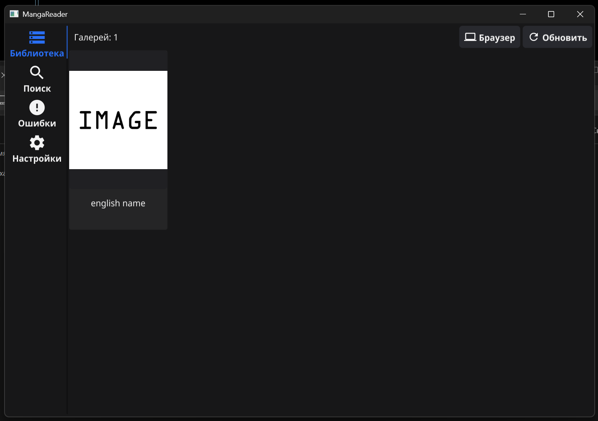
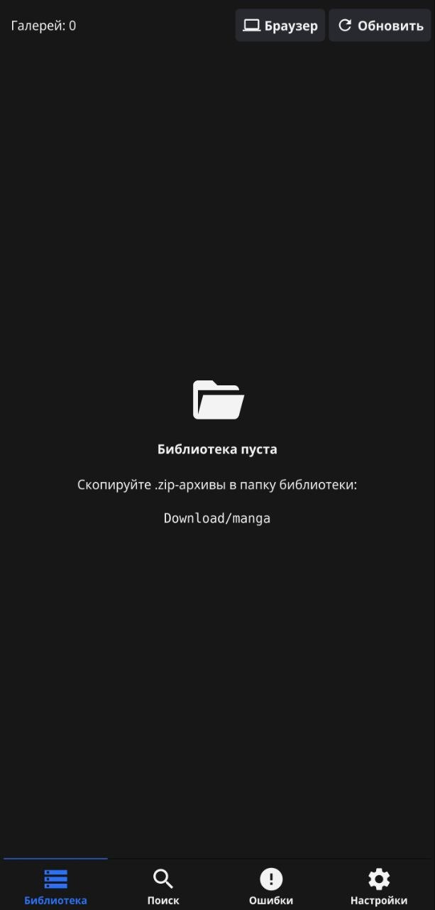
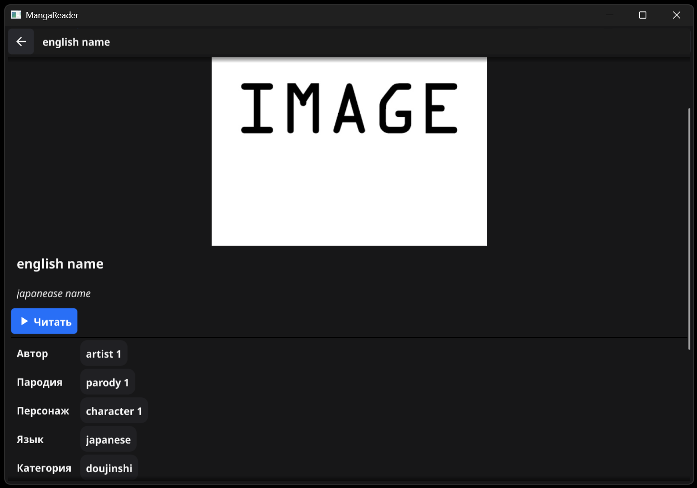
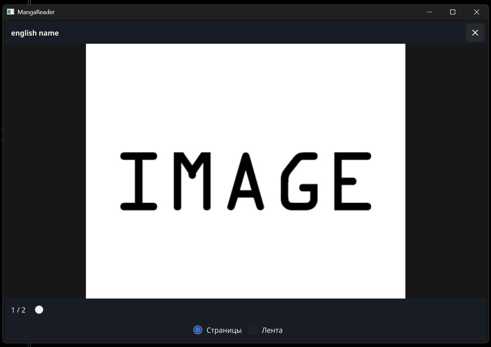
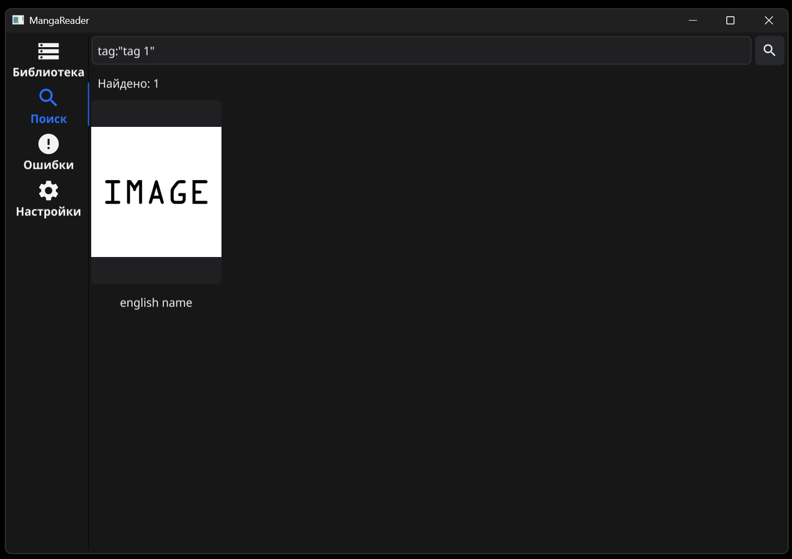

[English](../en/user-guide.md) | **Русский**

# Руководство пользователя

MangaReader показывает мангу из zip-архивов, которые лежат в папке библиотеки, и помогает пополнять её: встроенный браузер сохраняет загрузки прямо туда. Интернет нужен только браузеру — библиотека, читалка и поиск работают офлайн.

> Интерфейс на русском и английском. По умолчанию он следует языку системы (если перевода на него нет — английский); язык выбирается в **Настройках** → **Язык / Language**.

- [Папка библиотеки](#папка-библиотеки)
- [Формат архива](#формат-архива)
- [Библиотека](#библиотека)
- [Страница произведения](#страница-произведения)
- [Читалка](#читалка)
- [Поиск](#поиск)
- [Встроенный браузер](#встроенный-браузер)
- [Ошибки](#ошибки)
- [Настройки](#настройки)

## Папка библиотеки

### Windows — портативный режим

Всё хранится в папке приложения, больше нигде (ни в `%APPDATA%`, ни в профиле пользователя):

```text
MangaReader\
├── mangareader.exe
├── settings.json   ← настройки, появляется после первого изменения
├── library.db      ← каталог библиотеки (создаётся сам, можно удалить)
├── user.db         ← ваши данные о произведениях (не удалять)
├── manga\          ← сюда кладите .zip-архивы (создаётся при первом запуске)
└── browser\
    ├── firefox\    ← встроенный браузер
    └── profile\    ← профиль браузера: закладки, cookies, расширения
```

- Папку приложения можно переносить целиком, например на флешку. Переносите её, когда приложение закрыто.
- `library.db` — каталог библиотеки: разобранные архивы, ошибки, обложки, поиск и копия ссылок на страницы скачанных файлов. С ним приложение при запуске сразу показывает библиотеку и открывает только новые и изменённые архивы. Это кэш: если удалить файл, он создастся заново, а библиотека просканируется целиком. На Android каталог лежит в личной папке приложения.
- `user.db` — ваши собственные данные о произведениях, которые нельзя восстановить из архивов. В отличие от каталога, его не удаляйте: сохраняйте при обновлении и переносе приложения. Записи следуют за архивом, если его переименовать или переместить в другую подпапку `manga` (приложение узнаёт архив по страницам). Если файл повреждён, приложение переименует его в `user.db.broken-<дата-время>`, создаст новый и сообщит об этом при запуске; повреждённая копия остаётся рядом. На Android `user.db` лежит в личной папке приложения.
- Не кладите её туда, где нет прав на запись (например, в `Program Files`): приложение покажет ошибку с путём.
- Архивы можно раскладывать по подпапкам внутри `manga` — они тоже попадут в библиотеку.

### Android — папка, выбранная вами

При первом запуске откроется системный выбор папки. Выберите или создайте папку **внутри** `Download`, например `Download/manga`, и нажмите «Использовать эту папку» → «Разрешить». Приложение запомнит выбор и будет видеть всё, что лежит в этой папке и её подпапках: файлы, сохранённые браузером, перенесённые файловым менеджером или скопированные с ПК по USB. Особые разрешения («доступ ко всем файлам») не нужны.

- Корень `Download` Android выбрать не даёт. Если браузер сохранил архив прямо в `Download`, перенесите его в выбранную папку.
- Сменить папку: **Настройки** → **Изменить папку**.
- Если папку удалили или переименовали, приложение попросит выбрать её снова.
- Копирование с ПК через adb: `adb push example.zip /sdcard/Download/manga/`.

### Автообновление

Пока приложение открыто, библиотека обновляется сама: новые, изменённые и удалённые файлы появляются через секунду-две, без кнопки **Обновить**. Незавершённые загрузки (`*.part`) не мешают — файл проверяется, когда загрузка закончится. Если файл ненадолго занят другой программой (например, антивирусом), приложение подождёт.

## Формат архива

Галерея — это `.zip`-архив с изображениями (`.jpg`, `.jpeg`, `.png`, `.gif`, `.webp`) и, по желанию, файлом `meta.json`:

```text
example.zip
└── example/
    ├── 1.jpg
    ├── 2.jpg
    └── meta.json
```

- Страницы идут в натуральном порядке имён: `2.jpg` раньше `10.jpg`. Вложенные папки внутри архива допускаются.
- Имена файлов внутри архива могут быть в любой кодировке (например, Shift-JIS из японских архиваторов), папки — разделены `/` или `\`. Служебные файлы (`__MACOSX`, имена на `.`) пропускаются; если у нескольких файлов одинаковое имя, берётся первый.
- Первая страница — обложка.
- Без `meta.json` названием становится имя файла, тегов и сведений нет.

Поля `meta.json`, которые понимает приложение (остальные игнорируются):

| Поле | Что это | Где видно |
|---|---|---|
| `title.english` | Основное название | Карточка, страница произведения, читалка |
| `title.japanese` | Альтернативное название (или основное, если английского нет) | Страница произведения |
| `id` | ID на сайте (число или строка с числом) | Поиск `id:` |
| `tags` | Список `{"type": "...", "name": "..."}`; типы `artist`, `group`, `parody`, `character`, `language`, `category`, `tag`, другие — тоже показываются | Страница произведения, поиск |
| `upload_date` | Дата загрузки на сайт (Unix-время) | «Загружено», поиск `uploaded:` |
| `num_pages` | Число страниц по данным сайта | «Страниц», если не совпадает с архивом |
| `num_favorites` | Число добавлений в избранное на сайте | «Избранное», поиск `favorites:` |
| `scanlator` | Сканлейтор | «Сканлейтор», поиск `scanlator:` |
| `url`, `source`, `link`, `source_url`, `gallery_url` | Ссылка на произведение (берётся первая `http(s)`) | Кнопка **Открыть в браузере** |

Пример — [`testdata/example.zip`](../../testdata/example.zip).

## Библиотека

Вкладка **Библиотека** показывает галереи сеткой карточек: обложка и название. Размер карточек выбирается в **Настройках** (раздел **Сетка**). Новые файлы — сверху (по времени изменения файла). Вверху — число галерей и кнопка **Обновить** (обычно она не нужна: папка отслеживается автоматически).



Нажатие на карточку открывает страницу произведения. Кнопка 🎲 на панели открывает страницу случайной галереи из библиотеки; пока библиотека пуста, кнопка неактивна. Если библиотека пуста, приложение покажет путь к папке, куда нужно положить архивы; скопировать путь можно в **Настройках**.



### Меню карточки

На каждой карточке в библиотеке и в результатах поиска в правом верхнем углу обложки есть кнопка **⋮**. То же меню открывается правым кликом по карточке (ПК) и долгим нажатием (телефон):

- **Открыть** — страница произведения;
- **Читать** — читалка с первой страницы; после её закрытия вы вернётесь к сетке;
- **Открыть в браузере** — только если известна ссылка на произведение; работает как кнопка на странице произведения;
- **Скопировать название** — основное название в буфер обмена;
- **Показать в папке** (только Windows) — Проводник в папке архива, файл выделен;
- **Удалить…** — удаление архива с подтверждением (см. ниже).

### Удаление архива

**Удалить…** всегда спрашивает подтверждение и показывает название и путь файла внутри папки библиотеки:

- **Windows**: файл перемещается в **корзину**, оттуда его можно восстановить. Если на диске корзины нет (флешка, сетевой диск), приложение сообщит об этом и предложит удалить файл безвозвратно.
- **Android**: файл удаляется **безвозвратно** — у папок Android корзины нет, и подтверждение прямо об этом говорит. Для удаления нужен доступ на запись к папке библиотеки: если он выдан только на чтение, приложение попросит выбрать папку заново.

Карточка сразу исчезает из библиотеки и результатов поиска, затем библиотека пересканируется. Ваши данные о произведении хранятся срок из **Настройки → Хранение данных**: если файл восстановить (например, из корзины), данные вернутся. Если файл занят другой программой, приложение сообщит об этом, файл останется на месте. Произведение, открытое в читалке, удалить нельзя — сначала закройте его.

## Страница произведения

Здесь собрано всё об одной галерее:




- обложка, название и альтернативное название;
- кнопка **Читать**;
- кнопка **Открыть в браузере** — если известна ссылка на произведение: из `meta.json` или адрес страницы, с которой файл скачан встроенным браузером;
- теги по группам: «Автор», «Группа», «Пародия», «Персонаж», «Язык», «Категория», «Теги», затем группы других типов. Свои теги идут в группе после оригинальных и выделены жёлтым фоном. **Нажатие на тег открывает поиск по нему**;
- сведения: «Страниц», «Загружено», «Избранное», «Сканлейтор», «Файл», «Размер», «Изменён». Пустые поля не показываются.

Кнопка **⋮** справа в верхней полосе содержит действия, которых нет на самой странице: **Скопировать название**, **Показать в папке** (Windows) и **Удалить…**. После удаления страница закрывается, и вы возвращаетесь к сетке.

### Изменение тегов

Теги из `meta.json` задаёт сайт. Вы можете добавить свои теги любого типа и скрыть ненужные; архив и `meta.json` при этом не меняются. Нажмите **Изменить теги** под сведениями; **Готово** выходит из режима редактирования (закрытие страницы тоже). Каждое изменение сохраняется сразу. В режиме редактирования:

- **+** в группе добавляет тег этого типа. Введите имя и нажмите Enter или **Добавить**; Esc или **Отмена** закрывает поле. При вводе ниже показывается до 10 подсказок: имена этого типа из библиотеки и ваши свои теги, сначала самые частые. Нажмите на подсказку, чтобы добавить её.
- **Добавить в другую группу** добавляет тег типа, которого у произведения ещё нет (например, «Группа»).
- **✕** на своём теге удаляет его. **✕** на оригинальном теге скрывает его: в режиме редактирования он остаётся на месте красным зачёркнутым текстом с кнопкой **↺**, которая возвращает его; вне режима он не показывается, а группа только из скрытых тегов пропадает.
- **Сбросить к оригиналу…** после подтверждения удаляет все свои теги и снова показывает все скрытые.

Имена хранятся в нижнем регистре с одиночными пробелами, как оригинальные теги. Имя не может быть пустым, длиннее 100 символов или содержать `"`. Если у произведения уже есть тег того же типа и имени (оригинальный, скрытый или свой), приложение сообщит «Такой тег уже есть» и ничего не изменит.

Свои и скрытые теги хранятся в `user.db` (см. [Windows — портативный режим](#windows--портативный-режим)). Они сохраняются после перезапуска и переходят к архиву, если его переименовать или переместить внутри папки библиотеки. Если `user.db` открыть не удалось, кнопка **Изменить теги** неактивна, а теги из `meta.json` показываются как обычно.

## Читалка

Читалка открывается кнопкой **Читать** поверх всех вкладок. Закрыть — кнопкой ✕ на панели, клавишей Esc (ПК) или «Назад» (Android). Esc и «Назад» закрывают сначала читалку, затем страницу произведения.



Два режима, переключаются на панели и запоминаются:

**Страницы** — по одной странице, западный порядок (слева направо):

| Действие | ПК | Телефон |
|---|---|---|
| Следующая страница | →, ↓, PageDown, Пробел, колесо вниз, клик по правой трети | Тап по правой трети, свайп справа налево |
| Предыдущая страница | ←, ↑, PageUp, колесо вверх, клик по левой трети | Тап по левой трети, свайп слева направо |
| Первая / последняя | Home / End | Ползунок на панели |
| Увеличить ×2 / вернуть | Двойной клик | Двойной тап |
| Двигать увеличенную страницу | Перетаскивание, колесо | Перетаскивание |
| Показать / скрыть панель | Клик по центральной трети | Тап по центральной трети |

**Лента** — все страницы одна под другой, прокрутка: колесо, ↓/↑, PageDown/PageUp, Пробел; → и ← — к следующей и предыдущей странице; Home/End — в начало и конец. Одиночный тап показывает и скрывает панель.

Панель: название, номер страницы «N / всего», ползунок перехода к странице, переключатель **Страницы** / **Лента** и кнопка закрытия. Страницы загружаются в фоне; соседние подгружаются заранее.

## Поиск

Вкладка **Поиск** ищет по всей библиотеке. Условия через пробел объединяются по «И». Регистр букв, «ё»/«е» и ширина символов не важны: `елка` найдёт «Ёлка», `ＡＢＣ` — «ABC». Когда запрос выполняется, зависит от режима в **Настройках**:

- **При вводе** (по умолчанию) — через полсекунды после того, как вы перестали печатать; результаты появляются и при открытой клавиатуре. Кнопки 🔍 нет, Enter только закрывает клавиатуру.
- **По кнопке** — только по 🔍 или Enter.

Кнопка **✕** очищает поле, а результаты остаются на экране. Кнопка 🎲 рядом открывает страницу случайной галереи из текущего результата; она видна всегда, но неактивна, пока запрос ничего не нашёл. Запрос с ошибкой оставляет прежние результаты — 🎲 выбирает из них. Справка **Как искать** показывается, пока за сеанс не выполнен ни один запрос; дальше на экране всегда последний результат, даже при пустом поле — таблица ниже заменяет справку.



| Запрос | Что найдёт |
|---|---|
| `school` | Часть слова в названии, тегах, сканлейторе, имени файла, ID |
| `"english name"` | Фразу целиком |
| `tag:"tag 1"` | Точный тег любого типа |
| `artist:"artist 1"` | Тег определённого типа: `artist`, `group`, `parody`, `character`, `language`, `category` |
| `-tag:yuri` | Исключить произведения с тегом (так же `-artist:…` и т. д.) |
| `custom-tag:"my fav"` | Свой тег любого типа, см. [Изменение тегов](#изменение-тегов) |
| `hidden-tag:yuri` | Оригинальный тег, который вы скрыли |
| `pages:>20` | Число страниц: `>`, `<`, `>=`, `<=`, диапазон `10..50` |
| `uploaded:2024` | Дата загрузки на сайт: `2024`, `>2024-06`, `2024-01..2024-03` |
| `added:>=2025-01` | Когда файл появился в папке (время изменения файла) |
| `size:>10mb` | Размер файла: `k`, `mb`, `gb` |
| `favorites:>100`, `id:535147` | Избранное на сайте и ID |
| `scanlator:имя` | Сканлейтор |
| `school pages:>20 -tag:yuri` | Всё вместе |

Теги ищутся такими, какими вы видите их на странице произведения: `tag:`, `artist:` и другие типы находят нескрытые оригинальные теги и ваши свои, а слово из запроса не совпадает со скрытыми тегами. `custom-tag:` находит только свои теги, `hidden-tag:` — только скрытые; оба работают с `-`.

Даты: `2024` — весь год, `2024-06` — месяц, `2024-06-15` — день; `>период` — после его конца, `<период` — до начала. Если в запросе ошибка, под строкой поиска появится «Ошибка в запросе: …» с пояснением. Результаты обновляются сами, когда меняется библиотека: повторяется последний выполненный запрос.

## Встроенный браузер

Кнопка **Браузер** на панели библиотеки открывает браузер на движке Firefox. Всё, что вы в нём скачиваете, сохраняется прямо в папку библиотеки и через секунду-две появляется в библиотеке (или на вкладке **Ошибки**, если это не архив). У скачанных файлов запоминается адрес страницы, откуда они скачаны, — для кнопки **Открыть в браузере**.

### Windows

- Портативный Firefox ESR из папки `browser\firefox`; установленные в системе браузеры и их профили не используются.
- Окно браузера привязано к окну приложения, как браузер в Telegram: всегда поверх него, сворачивается вместе с ним, без отдельной кнопки на панели задач. Закрытие приложения закрывает браузер.
- Вкладки переключаются кнопкой «Все вкладки» в шапке (рядом — «Новая вкладка»). Кнопка «MangaReader» (значок книги) сворачивает браузер и показывает приложение.
- Расширения ставятся с addons.mozilla.org и сохраняются в профиле. Тема браузера всегда тёмная.
- Обновления, телеметрия, реклама и приветственные окна Firefox отключены. Версия Firefox обновляется вместе с приложением.
- Меню, настройки и окна Firefox — на языке приложения (он применяется при следующем открытии браузера после перезапуска приложения); строки, которых нет в переводе, — на английском. Сайтам запрашиваются страницы на том же языке, как в обычном Firefox; если изменить языки страниц в настройках Firefox, выбор сохраняется.
- Адрес страницы-источника хранится в самом файле (поток NTFS) и переживает переименование; при копировании на флешку FAT/exFAT теряется. Для файлов, скачанных другими браузерами, используется метка загрузки Windows — сайты часто обрезают её до главной страницы.
- Firefox, пока открыт, хранит несколько значений в реестре (`HKCU\Software\Mozilla\Firefox`); после закрытия браузера приложение их удаляет, значения других установок Firefox не трогаются.

### Android


- Движок Firefox (GeckoView) внутри приложения — экраном поверх читалки, без отдельной иконки.
- Панель: адрес или поиск, назад/вперёд, обновить, **вкладки** (число — сколько открыто), **MangaReader** (вернуться в читалку), **☆** (закладка), меню: новая вкладка, закладки, загрузки, расширения. Панель можно поставить сверху или снизу.
- «MangaReader» и системная «Назад» на первой странице вкладки возвращают в читалку; вкладки сохраняются, пока система не выгрузила приложение.
- Чтобы браузер занимал меньше памяти, неактивные вкладки выгружаются: в браузере загружены текущая и предыдущая, после возврата в читалку — только текущая. Выгруженная вкладка остаётся в списке и при выборе загружается заново с той же историей (введённое в формы при этом не сохраняется). Вкладка, с которой идёт загрузка, не выгружается до её окончания.
- Загрузки сохраняются в корень папки библиотеки: во время загрузки — `имя.part`, при совпадении имени — `имя (1).zip`. Прогресс виден в шторке уведомлений (Android попросит разрешение при первой загрузке); загрузка не прервётся, если свернуть приложение.
- Расширения — с addons.mozilla.org кнопкой «Добавить в Firefox» (например, uBlock Origin); меню → «Расширения» — включить, выключить, удалить.
- Панель, меню, диалоги и уведомления о загрузках браузера — на языке приложения; сайты тоже получают запрос страниц на этом языке (как в Firefox, где язык страниц следует языку интерфейса).
- Браузеру нужна запись в папку библиотеки. Если папка была выбрана только для чтения, при первом открытии браузера приложение попросит выбрать её ещё раз.

## Ошибки

Приложение проверяет **все** файлы в папке библиотеки. Галереей становится только `.zip`-архив с изображениями; остальное попадает на вкладку **Ошибки** с причиной, например:

- «Изображение — поддерживаются только zip-архивы» (картинка, видео, аудио, PDF, RAR/7z, текст — тип определяется по содержимому, а не по расширению);
- «Веб-страница (HTML) вместо архива» — сайт вернул страницу с ошибкой или проверкой вместо файла;
- «не zip-архив или архив повреждён», «нет изображений», «Пустой файл», «Файл занят другой программой».

Причины показываются на текущем языке интерфейса — и для файлов, проверенных до смены языка.

Ошибочные файлы **не удаляются** — удалите или замените их сами; запись исчезнет после следующего сканирования. Число на иконке вкладки — непросмотренные ошибки; открытие вкладки отмечает их просмотренными.

Не считаются ошибками: скрытые файлы и папки (имя начинается с `.`) — туда можно убрать посторонние файлы; незавершённые загрузки (`*.part` и пустой файл рядом с `<имя>.part`).

## Настройки

Вкладка **Настройки**:

- **Язык / Language** — **Системный** (по умолчанию: язык системы, а если перевода на него нет — английский), **English** или **Русский**. Новый язык применяется после перезапуска приложения; до этого показывается подсказка на выбранном языке.
- **Папка библиотеки** — путь к папке; на Windows — кнопка **Скопировать путь**, на Android — **Изменить папку**.
- **Браузер** (Windows) — **Домашняя страница**, **Поисковик** (открывает настройки поиска Firefox), **Расширения**, **Очистить cookies и данные сайтов**, **Очистить историю**. Очистка выполняется при следующем открытии браузера; закладки сохраняются.
- **Браузер** (Android) — **Домашняя страница**, **Поисковик**, **Панель браузера** (**Снизу** / **Сверху**), очистка cookies и истории (сразу; закладки и расширения сохраняются).
- **Поиск** — режим запуска запроса: **При вводе** или **По кнопке** (см. [Поиск](#поиск)).
- **Случайный выбор** — как выбирает кнопка 🎲: **С повторами** (по умолчанию) — каждый раз из всего набора, одна и та же галерея может выпасть снова; **Без повторов** — галерея не выпадет снова, пока не выпадут все галереи набора, а новый круг не начинается с последней выпавшей. Библиотека и поиск ведут круги отдельно; круг начинается заново, если набор изменился (другой результат поиска, состав библиотеки после сканирования), и не сохраняется между запусками.
- **Сетка** — плотность сетки карточек в библиотеке и поиске; применяется сразу, без перезапуска. На Android — **Карточек в ряду**: **2**, **3** (по умолчанию) или **4**; в вертикальном положении карточки делят ширину экрана поровну, в горизонтальном они того же размера, а в ряду их больше. На Windows — **Размер карточек**: **Маленькие**, **Средние** (по умолчанию) или **Крупные**; число колонок зависит от ширины окна. После смены обложки загружаются заново под новый размер.
- **Экран** (Android) — **Ограничить 60 Гц** (включено по умолчанию): на экранах 120 Гц приложение просит у системы 60 Гц, и прокрутка идёт ровнее. Встроенный браузер работает с частотой, которую выбирает система.
- **Хранение данных** — **Хранить данные удалённых произведений**: **1 день**, **1 неделя**, **1 месяц** (по умолчанию), **3 месяца**, **1 год**, **Бессрочно** или **Своё число дней…** (целое число от 1 до 36500). Если файл произведения больше не найден в папке библиотеки (удалён или перемещён из неё), ваши данные о нём хранятся этот срок и вернутся, если файл появится снова — даже под другим именем или в другой подпапке. По истечении срока данные удаляются. Проверка выполняется после каждого успешного сканирования: если папка недоступна (вынута флешка, нет доступа) или в ней нет ни одного файла, ничего не помечается и не удаляется.
- **О приложении** — версия.

Режим читалки запоминается автоматически. На Windows настройки хранятся в `settings.json` рядом с приложением.
